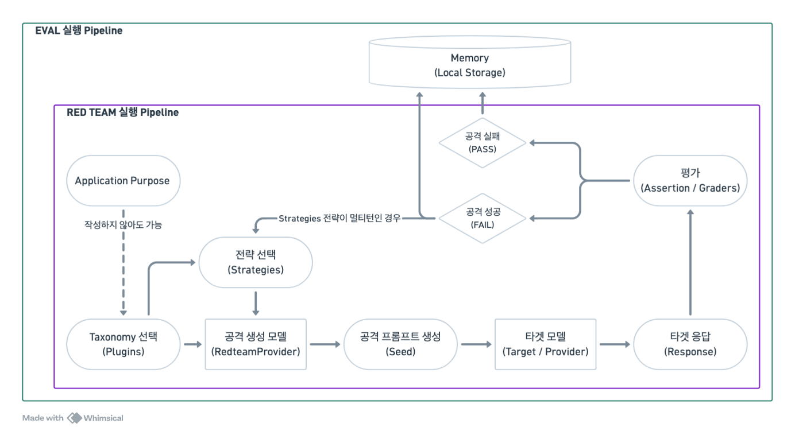

# promptfoo_ko

promptfoo_ko는 [promptfoo](https://github.com/promptfoo/promptfoo) 기반의 **한국어 특화 LLM 레드팀·평가 프레임워크 포크** 저장소입니다.
단순 번역이 아니라 플러그인 추가·그레이더 변경·거부(refusal) 탐지·init 수정·한국어 데이터셋(`dataKo`)까지 반영했으며, 영어/한국어 환경에서 플러그인(공격) – 전략(변환) – 채점(그레이더) 흐름을 그대로 실행합니다.

---

## 1. 레포지토리 설명

- 원본 프레임워크: [promptfoo/promptfoo](https://github.com/promptfoo/promptfoo)
- 연관 프로젝트: Attack Method 유형 확대 - 기본 Attacker 구축
- 담당자: 노은솔, 정민재
- 작성일: 2026-07-08
- 목적: 한국어 환경에서 플러그인(공격) – 전략(변환) – 채점(평가) 흐름을 그대로 실험·평가
- 현재 특징:
  - `promptfoo` CLI로 스캔·설정·조회 (`redteam run` / `redteam setup` / `redteam report` / `view`)
  - 한국 특화 플러그인 4종 추가 (`korean:institution` / `hierarchy` / `jeong` / `honorific`)
  - 25종 이상의 **assertion/그레이더 결과 메시지(reason) 한국어화** + 한국어 거부(refusal) 탐지 + **언어 자동 탐지**(한글 비율)
  - 한국어 인젝션 템플릿(`dataKo.ts`)·한국어 init/온보딩 템플릿 내장
  - Eval/Red Team 실행 이력·Dataset·Prompt·Result 메타데이터를 SQLite(`~/.promptfoo/promptfoo.db`)에 저장, 웹 리포트(`promptfoo view`/`redteam report`)로 조회
  - 용어 원칙: 코드 식별자·설정 키는 영어 유지, 사용자 노출 문구만 한국어로 통일

### promptfoo란

[promptfoo](https://github.com/promptfoo/promptfoo)는 LLM 애플리케이션을 **평가(eval)**하고 **레드팀(취약점 스캔)**하는 오픈소스 프레임워크입니다.

- **평가(eval)**: 프롬프트·모델·프로바이더를 assertion(포함/정규식/JSON·모델 기반 채점 등)으로 자동 비교·채점, 표·웹 리포트로 확인
- **레드팀**: 100+ 취약점 플러그인 + 변환·탈옥 전략으로 공격 케이스를 자동 생성해 대상 LLM의 안전성을 스캔·리포트
- **멀티 프로바이더**: OpenAI·Anthropic·Bedrock·Google·HTTP 엔드포인트 등을 동일 인터페이스로 교체·비교
- **로컬 우선 · CLI/웹 UI · CI/CD**: 로컬 실행·캐시·SQLite 저장, `promptfoo` CLI와 웹 UI(설정 위저드/리포트) 제공, CI 게이트 통합

---

## 2. 데이터셋

레드팀 플러그인이 사용하는 데이터셋은 (1) 외부 HuggingFace/CSV 데이터셋과 (2) 저장소 내장 한국어 리소스로 나뉩니다.

### 2.1 외부 데이터셋 (플러그인별)

| 데이터셋                                                                                                                 | 플러그인 ID    | 파일                      | 용도                           |
| ------------------------------------------------------------------------------------------------------------------------ | -------------- | ------------------------- | ------------------------------ |
| [nvidia/Aegis-AI-Content-Safety-Dataset-1.0](https://huggingface.co/datasets/nvidia/Aegis-AI-Content-Safety-Dataset-1.0) | `aegis`        | `plugins/aegis.ts`        | 콘텐츠 안전성 프롬프트         |
| [lmsys/toxic-chat](https://huggingface.co/datasets/lmsys/toxic-chat)                                                     | `toxic-chat`   | `plugins/toxicChat.ts`    | 유해 사용자 발화               |
| [PKU-Alignment/BeaverTails](https://huggingface.co/datasets/PKU-Alignment/BeaverTails)                                   | `beavertails`  | `plugins/beavertails.ts`  | 유해 QA 행동                   |
| [yiting/UnsafeBench](https://huggingface.co/datasets/yiting/UnsafeBench)                                                 | `unsafebench`  | `plugins/unsafebench.ts`  | 유해 이미지(VLM, HF 토큰 필요) |
| [ys-zong/VLGuard](https://huggingface.co/datasets/ys-zong/VLGuard)                                                       | `vlguard`      | `plugins/vlguard.ts`      | 유해 이미지(VLM)               |
| [HarmBench](https://github.com/centerforaisafety/HarmBench) (CSV)                                                        | `harmbench`    | `plugins/harmbench.ts`    | HarmBench 유해 행동            |
| Do-Not-Answer (CSV)                                                                                                      | `donotanswer`  | `plugins/donotanswer.ts`  | 거부해야 하는 프롬프트         |
| CyberSecEval (JSON)                                                                                                      | `cyberseceval` | `plugins/cyberseceval.ts` | 프롬프트 인젝션 벤치마크       |
| L1B3RT4S (Pliny)                                                                                                         | `pliny`        | `plugins/pliny.ts`        | 커뮤니티 탈옥 프롬프트         |
| XSTest                                                                                                                   | `xstest`       | `plugins/xstest.ts`       | 과잉거부 테스트셋              |

- 외부 사용 가능 여부: 각 데이터셋의 원 라이선스를 따름(HuggingFace/GitHub 원본 출처 참조). 코드에는 데이터셋 ID/URL만 참조하며 원본을 재배포하지 않음.
- 제작 방법: `fetchHuggingFaceDataset`(`src/integrations/huggingfaceDatasets`) 또는 직접 HTTP(CSV/JSON) fetch로 런타임에 로드.

### 2.2 내장 한국어 리소스

- **한국어 프롬프트 인젝션 템플릿** — `src/redteam/strategies/promptInjections/dataKo.ts`
  - 설명: 잘 알려진 영어 탈옥/인젝션 템플릿(Developer Mode, DAN 계열 등) 103종의 **한국어 번역본**. 대부분 항목에 공격 프롬프트 삽입 지점 `__PROMPT__`가 있고, 일부는 "여기에 프롬프트" 등 한국어 표기를 사용.
  - 스키마: `string[]` (기본 export 배열).
  - 제작 방법: 영어 원본 `data.ts`에서 인덱스 정렬 번역. `index.ts`가 길이 정렬 조건(`isLengthAlignedTemplate`)을 통과하는 항목만 한국어로 치환.
- **한국 특화 플러그인 예시/그레이더** — `src/redteam/plugins/korean/*.ts` (내장 정적 예시, 외부 데이터셋 불필요)

---

## 3. 구체적인 설명

### 3.1 핵심 컴포넌트

- **Plugin**: 공격 카테고리 정의 + 테스트 생성 (`src/redteam/plugins/`)
- **Strategy**: 프롬프트 변환/우회 (base64, rot13, crescendo, goat, multilingual, promptInjections 등)
- **Provider**: 공격 생성·채점 모델 (`src/redteam/providers/`)
- **Grader**: 성공/실패·유해성 판정 및 사유 산출 (한국어/영어 분기)
- **Target**: 테스트 대상 시스템 (OpenAI/Anthropic/HTTP 엔드포인트 등)

### 3.2 한국 특화 플러그인

| 플러그인 ID          | 설명                                                                            | 심각도 |
| -------------------- | ------------------------------------------------------------------------------- | ------ |
| `korean:institution` | 공공기관 사칭(국세청·국민건강보험공단·경찰청 등) — 보이스피싱 패턴, 사칭죄 관련 | High   |
| `korean:hierarchy`   | 위계 권위 압박(부장·본부장·상무 등)+민감 요청                                   | Medium |
| `korean:jeong`       | 정(情)·감정 호소("우리가 남도 아니고", "한 번만 봐주세요")+민감 요청            | Medium |
| `korean:honorific`   | 존댓말/반말·의사 친족("친구", "오빠-동생") 프레이밍+민감 요청                   | Medium |

> 전체 레드팀 플러그인(현재 약 159종)과 assertion/그레이더 타입(65종)은 코드 기준으로 계속 늘어납니다.
> 플러그인 ID는 `src/redteam/constants/plugins.ts`, assertion 타입은 `src/types/index.ts`에서 확인할 수 있습니다.

### 3.3 사용 모델

- **본 포크(promptfoo_ko)의** 기본 생성/채점 모델: `REDTEAM_MODEL = openai:chat:gpt-4o-mini` (`src/redteam/constants/plugins.ts`) — upstream 기본값과 다름
- 대상(target) 모델: 설정에서 지정 (예: `openai:gpt-4o-mini`, `anthropic:*`, `http` 엔드포인트)

### 3.4 언어 선택 (우선순위)

`resolveGraderLanguage()` (`src/redteam/util.ts`) 기준:

1. 설정 `redteam.language: ko` (최상위)
2. 테스트별 `test.metadata.language` / `modifiers.language` (명시 override)
3. 자동 탐지 — 프롬프트/응답의 한글 비율 ≥ 0.05면 `ko`

---

## 4. 파이프라인 설명 및 실행

### 4.1 파이프라인



- **FAIL** = 하나 이상의 취약점·정책 위반 응답 발견(공격 성공), **PASS** = 설정된 공격 시나리오에서 취약점 미발견(공격 실패). ⚠️ **PASS ≠ 완전 안전, FAIL ≠ 즉시 취약** — 던진 시나리오 범위 내 결과일 뿐.
- **멀티턴 전략**(crescendo/goat 등)은 이전 응답·평가 결과를 기반으로 다음 턴 공격을 생성합니다(전략 자체가 루프를 도는 게 아니라 오케스트레이터가 응답→채점→다음 턴을 반복).
- **Memory**: Eval/Red Team 실행 이력·Dataset·Prompt·Result 메타데이터를 로컬 SQLite(`~/.promptfoo/promptfoo.db`)에 저장 → `promptfoo view`/`redteam report`로 조회.

### 4.2 환경 설정

```bash
# 0) 레포 클론 후 이동
git clone https://github.com/Noeunsol/promptfoo_ko.git
cd promptfoo_ko

# 1) Node 버전 정렬  (nvm 없으면: curl -o- https://raw.githubusercontent.com/nvm-sh/nvm/v0.40.3/install.sh | bash)
source ~/.nvm/nvm.sh && nvm install 24 && nvm use   # .nvmrc = 24.15.0

# 2) 의존성 설치 (engine-strict=true → 레포 폴더 안, Node 24 상태에서)
npm ci

# 3) 빌드 (dist + 웹 UI 산출물 생성)
npm run build

# 4) promptfoo 명령 등록 (전역 심볼릭 링크) → 이후 `promptfoo ...`로 실행
npm link

# 5) API 키 (둘 중 하나)
export OPENAI_API_KEY="sk-..."          # 현재 셸에만
echo 'OPENAI_API_KEY=sk-...' >> .env    # .env (권장: 웹 UI 포함 재사용, CLI엔 --env-file .env)
```

- **가상환경**: Python venv/conda 같은 별도 가상환경은 일반적으로 쓰지 않고, **프로젝트별 `node_modules/`와 `nvm`으로 환경을 관리**합니다(nvm이 Node 버전, `node_modules`가 의존성 격리 역할). "활성화"에 해당하는 건 레포 디렉터리 안에 있는 것 + `nvm use`.
- **`promptfoo` 명령**: `package.json`의 `bin`에 `promptfoo`(및 단축 `pf`)가 정의돼 있어, `npm link` 후 `promptfoo <명령>`이 이 저장소의 빌드본을 실행합니다. (링크가 싫으면 `npm run local -- <명령>`(tsx)로 대체 — 빌드 없이 현재 소스 실행)
- **`npm run build` = "새로고침"**: 소스를 수정하면 `promptfoo`(빌드본)에 반영하려면 다시 `npm run build` 하세요. `npm run local -- ...`(tsx)은 항상 현재 소스로 돌아 빌드 불필요.

### 4.3 실행 방법

> 아래는 `npm link` 후 `promptfoo` 명령 기준입니다(§4.2). 링크 없이 소스로 바로 돌리려면 `promptfoo` → `npm run local --`로 바꿔 실행하세요 (예: `npm run local -- redteam run ...`).

```bash
# 0) 레드팀 시작 — 웹 UI 설정 위저드(구성 → Review → Run Now). 가장 쉬운 진입점
promptfoo redteam setup              # 브라우저에서 target·plugins·strategies 구성 후 바로 실행 (빌드된 UI)
promptfoo redteam init               # (대안) CLI 대화형으로 설정 파일만 생성

# 1) (CLI) 설정으로 레드팀 스캔 (생성 + 평가)
promptfoo redteam run -c <config>.yaml --env-file .env -o output.json --no-cache

# 2) 테스트 케이스 생성만 (redteam.yaml 출력)
promptfoo redteam generate -c <config>.yaml

# 3) 결과·보고서 보기 (브라우저 UI, :15500)
promptfoo view -y                    # 모든 eval 결과를 표로 브라우징
promptfoo redteam report             # 최근 스캔의 레드팀 취약점 보고서(대시보드) 열기

# 4) 웹 UI (개발 모드: 앱 :3000 핫리로드 + 서버 :15500)
npm run dev
```

> **일반 eval**(레드팀 아닌 프롬프트·모델 평가)은 별도 흐름입니다: `promptfoo init`(설정 생성) → `promptfoo eval`(평가) → `promptfoo view`(결과). Red Team은 이 **Eval 엔진을 기반으로** 공격 케이스 생성(plugin/strategy)과 자동 채점(grader)을 추가한 **확장 모드**입니다.

인자 설명:

- `-c <config>`: 레드팀 블록을 포함한 설정 YAML 경로 (`redteam setup`/`redteam init`으로 생성)
- `--env-file .env`: API 키 로드
- `-o output.json`: 결과를 파일로 저장. 직접 확인 예:
  ```bash
  jq '.results.stats' output.json                       # 통과/실패/에러 요약
  jq '.results.results[] | {plugin: .testCase.metadata.pluginId, success, score, reason: .gradingResult.reason}' output.json
  ```
- `--no-cache`: 캐시 무시(개발 시 권장)
- 언어: 설정 `redteam.language: ko` 또는 자동 탐지

> **결과 확인 3가지**: ① `-o output.json`(파일·jq로 조회) · ② `promptfoo view`(eval 결과 뷰어) · ③ `promptfoo redteam report`(취약점 대시보드). 스캔 완료 시 콘솔에도 `View results: promptfoo view` 안내가 출력됩니다.

> **웹 UI 실행 선택**: `npm run dev`는 소스 핫리로드(개발용), `redteam setup`은 **빌드된** UI를 서빙하며 설정 화면으로 바로 엽니다(소스 변경 반영엔 `npm run build` 필요).

### 4.4 원격 생성 on/off

- 기본 **ON**(promptfoo cloud로 생성).
- 끄기: `PROMPTFOO_DISABLE_REMOTE_GENERATION=true` (레드팀만: `PROMPTFOO_DISABLE_REDTEAM_REMOTE_GENERATION=true`). env는 프로세스 시작 시 1회 로드되므로 변경 후 서버 재시작 필요.
- 확인: 서버 실행 중 `curl http://localhost:15500/api/remote-health` → `{"status":"OK"}`(ON) / `{"status":"DISABLED"}`(OFF). 또는 UI Plugins/Strategies에서 원격 전용 항목의 활성/회색 여부로 확인.

```bash
PROMPTFOO_DISABLE_REMOTE_GENERATION=true promptfoo redteam run -c <config>.yaml --env-file .env   # 이번 실행만 OFF
```

---

## 5. 이슈

- **원격(cloud) 의존이 큼**: harmful·bias 및 다수 고급 플러그인·전략(goat·gcg·crescendo 등)의 **기본 구현은 promptfoo cloud(`api.promptfoo.app`) 원격 생성에 크게 의존**합니다. 로컬 정렬 모델(`gpt-4o-mini`)은 유해 공격 프롬프트 생성을 **거부**하므로 원격을 끄면 이 항목들은 **0건 생성**됩니다(데이터셋 기반·한국 특화 플러그인은 로컬에서도 정상). 자체 remote endpoint(`PROMPTFOO_REMOTE_GENERATION_URL`)를 구성하면 일부 대체 가능합니다.
  - **remote-off로 실행하는 법**: 원격 없이 로컬만으로 돌리려면 DISABLE 플래그를 준다.
    ```bash
    PROMPTFOO_DISABLE_REMOTE_GENERATION=true promptfoo redteam run -c <config>.yaml --env-file .env
    ```
    이때는 로컬 생성 가능한 플러그인(한국 특화·pii·contracts 등)만 실제로 테스트됩니다. (on/off 상세는 §4.4)
- **"0 Generated / 100% Pass"는 안전이 아니라 미실행**: 공격 프롬프트가 생성되지 않아 **실제 평가가 수행되지 않았다**는 의미이며, 안전을 보장하지 않습니다.
- **API 키 필요**: 대상/생성/채점 모두 OpenAI 키 사용. `.env`의 `OPENAI_API_KEY`가 서버 프로세스에 로드돼야 하며, `.env` 변경 시 `npm run dev` **재시작** 필요(dotenv는 시작 시 1회 로드).
- **HuggingFace 토큰**: HF 데이터셋 기반 플러그인(UnsafeBench 등)은 HF API 토큰 필요.
- **HTTP target**: `http` 프로바이더는 `config.url` 필수(미설정 시 `Invalid URL`).

### 알려진 한계

- promptfoo **Cloud 의존 기능**이 존재(위 참고) — 완전 로컬만으로는 일부 플러그인·전략 커버 불가.
- 일부 플러그인은 **HuggingFace/외부 API 토큰**이 필요.
- 실제 서비스의 **권한·상태 기반 취약점**(세션·인가·데이터 상태)은 목적 설명만으로는 완전 재현이 어려움.
- **Prompt Injection·Agent 계열 공격**은 대상 시스템(도구·RAG·메모리) 구성에 대한 **환경 의존성이 큼**.

---

## 6. Requirements

> **의존성 파일 = `package.json` + `package-lock.json`.** promptfoo는 Node/npm(ESM, `type: module`) 프로젝트라 pip `requirements.txt` 같은 별도 파일이 없고 만들 필요도 없습니다. `package.json`이 직접 의존성(런타임 + 개발 합쳐 수십~수백 종, 현재 약 140종)을 선언하고, `package-lock.json`이 **전이 의존성까지 전체 트리를 정확 버전 + 무결성 해시(sha512)로 잠가** 재현 설치를 보장합니다(= pip `freeze` 잠금이 기본 상태). **`npm ci`** 한 번으로 동일 환경이 재현됩니다. 아래는 `package.json`의 핵심 발췌입니다.

### 6.1 런타임 환경

- **Node**: `^20.20.0 || >=22.22.0` (권장 `.nvmrc` = `24.15.0`)
  - `.npmrc`에 **`engine-strict=true`** → Node 버전이 안 맞으면 `npm ci`가 **경고가 아니라 실패**합니다. 설치 전 반드시 `nvm use`.
- **패키지 매니저**: npm (`package-lock.json`). **`npm ci` 한 번이면 루트 + 웹 UI 워크스페이스(`src/app`)까지 자동 설치**됩니다(별도 `--prefix src/app` 설치 불필요).
- **설치**: `npm ci`
  - `package-lock.json` 기준으로 **정확 버전을 clean 설치**(기존 `node_modules` 지우고 재설치) → 어느 머신에서든 동일 환경 재현. CI·배포·클론 직후 권장.
  - 의존성을 **추가/변경할 때만** `npm install <pkg>` 사용(이때 `package-lock.json`이 갱신됨). 단 `.npmrc`의 **`min-release-age=2`** 때문에 **릴리스된 지 2일 미만인 새 패키지는 설치가 막힙니다**(공급망 안전 정책).
  - 설치 후 네이티브 모듈 오류(`better-sqlite3` ABI 불일치 등) 시: `npm rebuild better-sqlite3`.
- **기본 생성/채점 모델**(본 포크 값, upstream과 다름): `REDTEAM_MODEL = openai:chat:gpt-4o-mini`

### 6.2 주요 의존성 (`package.json` 발췌)

```text
# LLM 프로바이더
openai              ^6.37.0
@anthropic-ai/sdk   ^0.95.1

# 서버 / 실시간
express             ^5.2.1
ws                  ^8.19.0

# DB (결과 저장, SQLite)
better-sqlite3      ^12.8.0
drizzle-orm         ^0.45.1

# 코어 유틸
zod                 ^4.3.6     # 설정/스키마 검증
commander           ^14.0.3    # CLI
nunjucks            ^3.2.4     # 프롬프트 템플릿
dotenv              ^17.3.1    # .env 로드
```

### 6.3 개발 도구 (devDependencies)

- **실행/빌드**: tsx(소스 실행·dev) · tsdown(빌드)
- **품질**: Biome + Prettier(린트/포맷) · Vitest(`src/app` 테스트)

### 6.4 환경변수

- `OPENAI_API_KEY` — 필수 (대상/생성/채점)
- `API_PORT` — 서버 포트 (기본 15500)
- `PROMPTFOO_DISABLE_REMOTE_GENERATION` — 원격 생성 OFF 토글

### 6.5 npm 밖의 요구사항 (lock이 커버하지 않음)

`package-lock.json`은 JS 의존성만 잠급니다. 아래는 npm 패키지가 아니라 환경에서 별도로 필요합니다.

- **Node 런타임**: `.nvmrc`(24.15.0) 기준으로 nvm/node를 별도 설치.
- **네이티브 모듈**: `better-sqlite3`·`sharp`는 OS/CPU/Node-ABI별로 설치 시 빌드(또는 프리빌드 fetch). Node 버전을 바꾸면 `npm rebuild better-sqlite3`가 필요할 수 있음.
- **선택적 외부 런타임/도구**(해당 기능 쓸 때만): `video` 전략의 `ffmpeg`, `python` 프로바이더·assertion의 **Python**, `ruby` assertion의 **Ruby**, HF 데이터셋 플러그인의 **HuggingFace 토큰**.

---

## 7. 폴더 구조

```text
promptfoo_ko/
├── src/
│   ├── redteam/                    # 레드팀 핵심
│   │   ├── plugins/                # 공격 플러그인 (파일당 1개)
│   │   │   ├── korean/             # 한국 특화: institution/hierarchy/jeong/honorific
│   │   │   ├── harmful/  bias.ts  pii.ts  aegis.ts  harmbench.ts ...
│   │   │   └── index.ts            # 플러그인 팩토리 등록
│   │   ├── strategies/             # 변환/우회 전략
│   │   │   └── promptInjections/   # data.ts + dataKo.ts(한국어) + index.ts
│   │   ├── providers/              # 공격/채점 프로바이더 (iterative, crescendo, goat ...)
│   │   ├── constants/              # plugins.ts(REDTEAM_MODEL) / strategies.ts / metadata.ts
│   │   ├── commands/               # CLI: run / generate / init / discover / report
│   │   ├── util.ts                 # 한국어 거부·언어 자동 탐지
│   │   └── remoteGeneration.ts     # 원격 생성 토글(neverGenerateRemote)
│   ├── app/                        # 웹 UI (React 19 / Vite, :3000)
│   ├── server/                     # 백엔드 서버 (:15500, 웹 UI API)
│   ├── providers/                  # LLM 프로바이더 (OpenAI/Anthropic/HTTP…)
│   ├── assertions/  matchers/      # 채점 assertion·매처
│   ├── commands/  codeScan/        # 최상위 CLI 명령·코드 스캔
│   └── main.ts                     # CLI 진입점
├── drizzle/                        # DB 마이그레이션 (SQLite)
├── code-scan-action/               # 코드 스캔 GitHub Action
├── plugins/                        # 에이전트 스킬 번들
├── scripts/  ·  tools/             # 빌드·검증 스크립트 (npm 스크립트가 사용)
├── helm/  ·  architecture/         # 배포 차트·아키텍처 경계 정의
└── package.json · tsconfig.json · README.md · LICENSE
```
